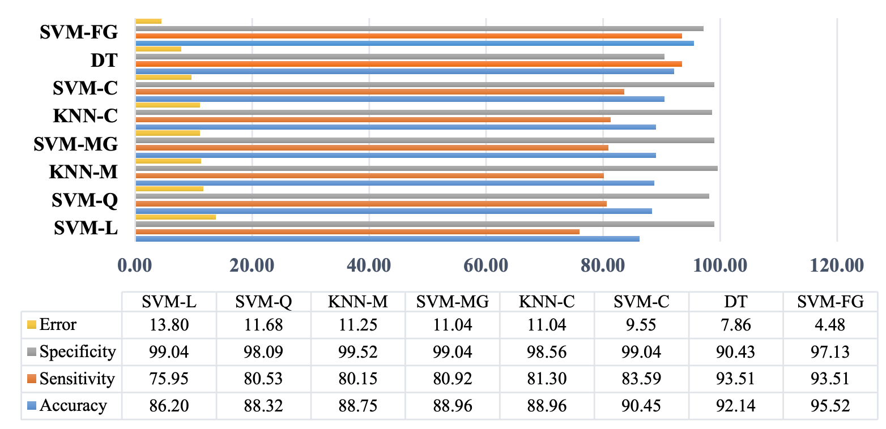

::: {.cell .markdown}

[](https://colab.research.google.com/github/shaivimalik/medicine_preprocessing-on-entire-dataset/blob/main/notebooks/Reproducing_Original_Result.ipynb)

# Reproducing "Characterization of Term and Preterm Deliveries using Electrohysterograms Signatures"

:::


::: {.cell .markdown}
## Introduction

In this notebook, we will reproduce the results published in **Characterization of Term and Preterm Deliveries using Electrohysterograms Signatures** [1]. Preterm birth occurs when a baby is born before 37 weeks of pregnancy. It is the leading cause of death in children under the age of five and is responsible for 35% of all newborn deaths. In 2020, an estimated 13.4 million babies were born prematurely, representing more than 1 in 10 births worldwide. The consequences of preterm birth are severe, with approximately 900,000 children dying in 2019 due to related complications. Many survivors face lifelong disabilities, including learning difficulties and visual and hearing problems [2].

The main challenge in combating preterm births is the delay in obtaining clinical proof, which can lead to increased labor complications and perinatal mortality [1]. Early prediction of preterm birth is crucial to prevent these deaths and complications. Once identified, healthcare providers can take essential measures to ensure extra care for the mother during labor and for the newborn baby. 

Recent advancements in machine learning and deep learning have opened doors for novel approaches to classify between term and preterm deliveries. These powerful tools hold immense promise for improving our ability to identify pregnancies at risk. This notebook aims to reproduce the results of one such study exploring the use of electrohysterograms (EHG) signatures to predict whether a delivery will be term or preterm.

### Objectives

- Understand the methodology used in the original paper.
- Implement the described algorithms and techniques.
- Analyze and compare our results with those published in the paper.
- Discuss an error in the preprocessing strategy.

:::

::: {.cell .code}
```python
# Uncomment the following lines if running on Google Colab
#!git clone https://github.com/shaivimalik/medicine_preprocessing-on-entire-dataset.git
#!pip install -r medicine_preprocessing-on-entire-dataset/requirements.txt
#%cd medicine_preprocessing-on-entire-dataset/notebooks
```
:::


::: {.cell .markdown}
## Retrieve the data

The **Term-Preterm EHG Database** [3] is a collection of EHG signals obtained from 1997 to 2005 at the University Medical Centre Ljubljana, Department of Obstetrics and Gynecology. Electrohysterogram signature is obtained by placing four electrodes on the abdomen of the mother. It is a non-invasive method to measure the electrical activity of the uterine muscle. 

The TPEHG DB consists of EHG records obtained from 262 women who had full-term pregnancies and 38 whose pregnancies ended prematurely. The records were obtained during regular check-ups either around the 22nd week of gestation or around the 32nd week of gestation. Each record is composed of three channels, recorded from 4 electrodes:

- the first electrode (E1) was placed 3.5 cm to the left and 3.5 cm above the navel;
- the second electrode (E2) was placed 3.5 cm to the right and 3.5 cm above the navel;
- the third electrode (E3) was placed 3.5 cm to the right and 3.5 cm below the navel;
- the fourth electrode (E4) was placed 3.5 cm to the left and 3.5 cm below the navel.

The differences in the electrical potentials of the electrodes were recorded, producing 3 channels:

- S1 = E2–E1 (first channel);
- S2 = E2–E3 (second channel);
- S3 = E4–E3 (third channel).

Each record consists of two files, a header file (.hea) containing information regarding the record and the data file (.dat) containing signal data [4].

We'll begin by acquiring the TPEHG DB (Term-Preterm ElectroHysteroGram Database) and extracting relevant features for training our model. 

_Note: The download may take some time depending on your internet connection speed._

:::

::: {.cell .code}
```python
!curl -o ../term-preterm-ehg-database-1.0.1.zip https://physionet.org/static/published-projects/tpehgdb/term-preterm-ehg-database-1.0.1.zip
!unzip ../term-preterm-ehg-database-1.0.1.zip -d ../
```
:::

::: {.cell .markdown}
## Reproducing the results of "Characterization of Term and Preterm Deliveries using Electrohysterograms Signatures"

**Characterization of Term and Preterm Deliveries using Electrohysterograms Signatures** [1] presents a method for preterm birth prediction using classifiers trained on Electrohysterogram signatures. In this study, four features were extracted from EHG signatures: **Median frequency, Shannon energy, Log energy and Lyapunov exponent**. These features were used to distinguish between term and preterm births. 

However, the TPEHG database presents a challenge: class imbalance. It contains a significantly higher number of term birth records (262) compared to preterm births (38). To address the class imbalance issue, the study employed the Adaptive Synthetic Sampling technique. This technique generates synthetic samples of the minority class to create a more balanced dataset. 

Using these features, various machine learning models were trained, including different types of Support Vector Machines (Linear, Quadratic, Cubic, Fine Gaussian, Medium Gaussian), Decision Trees, and K-Nearest Neighbor (Medium and Cubic) classifiers. 10-fold cross validation was used to assess the performance of these models, reporting accuracy, sensitivity, specificity, and error scores for each.

||
|:--------------------------------:|
| *figure from the original paper which compares the performance of different classifiers on the TPEHG database* |

In this notebook, we will reproduce the model with the highest reported accuracy: the **Support Vector Machine (SVM) with the radial basis function (RBF) kernel (SVM-FG)**. We will train the SVM-FG model and evaluate its performance using the same metrics reported in the paper: accuracy, error, sensitivity, and specificity. The model achieved the following performance metrics as reported in the paper:

| Metric        | Score           |   
|:-------------:|:---------------:|
| Accuracy      | 95.5%           |
| Error         | 4.48            |         
| Specificity   | 97.13           |
| Sensitivity   | 93.51           |

Overview of the sections:

- [Generate Features](#generate-features): We'll discuss the techniques used to extract features from raw EHG signals. We'll also do some exploratory data analysis on the generated features.

- [Addressing Class Imbalance](#addressing-class-imbalance): We'll discuss the ADASYN oversampling technique and its role in balancing the dataset.

- [SVM Classifier Training and Evaluation](#svm-classifier-training-and-evaluation): We'll implement the process of training the SVM (Support Vector Machine) model with the extracted features and its evaluation using 5-fold cross-validation.

- [Discussion](#discussion): Finally, we'll present and interpret the results obtained from the model.

:::

::: {.cell .markdown}
## Generate Features

In this section, we will extract features from raw electrohysterogram signatures. 

Raw EHG signals are corrupted due to the presence of noise and artifacts (identifiable disturbances that are not part of the genuine physiological signal). To remove the noise and artifacts and isolate the region of interest, Empirical Mode Decomposition technique (EMD) was leveraged in the study. EMD decomposes each signal into a series of signal components called Intrinsic Mode Functions (IMFs). IMFs represent different oscillatory modes present in the signal, each with its own amplitude and frequency modulation. The first IMF was identified as the region of interest in the paper. 

We will use Empirical Mode Decomposition to extract Intrinsic Mode Functions. Next, we will compute Median frequency, Shannon energy, Log energy and Lyapunov exponent from IMF-1. These computed features will be used for training our model.

The code cell below automates this process. It creates a directory named `individual_features` to store the feature files for each signal. Then, it executes two Python scripts:

- `all_features.py`: generates the individual feature files for each signal.

- `process_feature_files.py`: combines the individual feature files into a single dataset containing features extracted from 298 EHG signatures.

_Note: 2 EHG signals will be discarded due to their short recording lengths._

:::

::: {.cell .code}
```python
!mkdir ../individual_features
!python3 ../EHG-Oversampling/experiments/all_features.py ../term-preterm-ehg-database-1.0.1/tpehgdb ../individual_features --study FeaturesKhan
!python3 ../EHG-Oversampling/experiments/process_feature_files.py ../individual_features ../
```
:::

::: {.cell .markdown}
### Loading the features

In this section, we will load the dataset from the CSV files created in the previous step. For a quick refresher on the Pandas module, [check this out](https://pandas.pydata.org/docs/user_guide/10min.html).

We start by importing the required modules.

:::

::: {.cell .code}
```python
import os
import numpy as np
import pandas as pd
import matplotlib.pyplot as plt
from imblearn.over_sampling import ADASYN
from sklearn.svm import SVC
from sklearn.model_selection import GridSearchCV, StratifiedKFold
from sklearn.metrics import accuracy_score, recall_score
```
::: 

::: {.cell .markdown}

We load feature matrix (`features`) and labels (`y`) from CSV files. The `head()` method displays the first few rows of each dataframe for a quick overview.

:::

::: {.cell .code}
```python
#Loading feature vectors
features=pd.read_csv(os.path.join('..','raw_features.csv'))
features.head()
```
:::

::: {.cell .code}
```python
#Loading labels
y=pd.read_csv(os.path.join('..','target.csv'))
y.head()
```
:::

::: {.cell .markdown}
### Exploring the dataset

In this section, we will identify data types, check for null entries, compute summary statistics, and visualize the dataset using `matplotlib`.

We start by visualizing the count of term and preterm births in our dataset using a bar plot. The green bar indicates the frequency of term births, and the red bar indicates the frequency of preterm births.

:::

::: {.cell .code}
```python
# Count the occurrences of each class
term_count=y.value_counts()[1.0]
preterm_count=y.value_counts()[0.0]

# Print the counts
print("Count of preterm birth records:", preterm_count)
print("Count of term birth records:", term_count)

# Create bar plot
plt.bar(['Term Births','Preterm Births'],height=[term_count,preterm_count],color=['tab:green','tab:red'])
plt.ylabel("Frequency")
plt.xlabel("Type of Birth")
plt.show()
```
:::

::: {.cell .markdown}

Next, we create a scatter plot to visualize the times at which EHG signals were recorded. The time of recording is plotted on the x-axis, and the time of birth is plotted on the y-axis. It is evident that most EHG signals were recorded around the 22nd or 32nd week of gestation, confirming findings from [3].

:::

::: {.cell .code}
```python
# scatter plot of preterm and term records 
# the color of each point is determined by the corresponding label in 'y': green for term births (1.0) and red for preterm births (0.0)
plt.scatter(features['Rectime'], features['Gestation'] - features['Rectime'], c=['tab:green' if label == 1.0 else 'tab:red' for label in y['0']])

# X['Rectime'] is plotted on the x-axis, representing the time of recording in weeks
plt.xlabel('Time of Recording (weeks)')

# X['Gestation'] - X['Rectime'] is plotted on the y-axis, representing the time to birth in weeks
plt.ylabel('Time to birth (weeks)')

plt.show()
```
:::

::: {.cell .markdown}

This code cell plots the first 1000 samples from each of the three channels of a signal from the TPEHG database.

:::

::: {.cell .code}
```python
# Visualizing the EHG signals
import sys
# Add the parent directory to the Python path so we can import necessary modules
sys.path.append('../EHG-Oversampling')
from ehgfeatures.signal_io import get_signals

# Get the EHG signals from the specified directory, limiting to one signal for visualization
_, signals, *__ = get_signals('../term-preterm-ehg-database-1.0.1/tpehgdb', n_signals=1)

# Create a figure and subplots for plotting the EHG channels
fig, axs = plt.subplots(3, 1, figsize=(6,10))

# Plot the first 1000 samples of the first channel
axs[0].plot(signals[0][0][:1000])
# Set y-label for the first subplot
axs[0].set_ylabel("ch1")

# Plot the first 1000 samples of the second channel
axs[1].plot(signals[0][1][:1000])
# Set y-label for the second subplot
axs[1].set_ylabel("ch2")

# Plot the first 1000 samples of the third channel
axs[2].plot(signals[0][2][:1000])
# Set y-label for the third subplot
axs[2].set_ylabel("ch3")

# Set x-label for the entire plot
plt.xlabel("time/sample")

# Display the plot
plt.show()
```
:::

::: {.cell .markdown}

In the following cells, we extract the necessary features, present summary statistics, and check for null values.

:::

::: {.cell .code}
```python
# Extracting features required for our study
khan_features = [
 	'FeaturesJager_fmed_ch1', 'FeaturesJager_max_lyap_ch1',
 	'FeaturesJager_sampen_ch1', 'FeaturesJager_fmed_ch2',
 	'FeaturesJager_max_lyap_ch2', 'FeaturesJager_sampen_ch2',
 	'FeaturesJager_fmed_ch3', 'FeaturesJager_max_lyap_ch3',
 	'FeaturesJager_sampen_ch3',
 ]
generic_features=[ c for c in features.columns if 'FeaturesAcharya' in c and 'SampleEntropy' in c ]

# Extract the relevant features for the study
X = features[khan_features + generic_features]

# Display summary information about the selected features
X.info()
```
:::

::: {.cell .code}
```python
# Statistics of the features
X.describe()
```
:::

::: {.cell .code}
```python
# Checking for null values
X.isnull().sum()
```
:::

::: {.cell .markdown}
## Addressing class imbalance

The TPEHG database exhibits a class imbalance, containing 38 preterm records and 262 term records. Imagine a classifier which always predicts a term birth (probability of preterm birth = 0). On the TPEHG database, this classifier would achieve a high accuracy of 87.34% (262/300). However, this high accuracy stems from the imbalanced data, not the model's ability to distinguish between term and preterm births. This classifier would be ineffective at identifying preterm births, our outcome of interest. 

To prevent classifiers from developing biases towards the majority class, sampling techniques are used. These techniques aim to balance the representation of classes present in the dataset. This allow models to learn from a more balanced dataset and improve their generalizability for real-world prediction. 

- **Oversampling**: The minority class is upsampled to match the count of the majority class. 

- **Undersampling**: The samples of majority class are reduced to match the count of the minority class. However, remember that undersampling techniques can discard valuable information that might have been crucial for training the model.

In this notebook, we will use the Adaptive Synthetic Sampling technique to increase the count of the minority class (preterm birth) samples.

:::

::: {.cell .markdown}
### Adaptive Synthetic Sampling

Adaptive Synthetic Sampling is an oversampling technique in which we generate synthetic samples of the minority class to counter the class imbalance present in the original dataset. ADASYN generates more synthetic samples for the minority samples which are _harder to learn_. ADASYN quantifies the learning difficulty of a minority class sample by calculating the proportion of majority class samples among the sample's K nearest neighbors. More majority neighbors imply a _harder to learn_ minority sample [5]. Let's go through the algorithm in detail:

- **Calculate the degree of class imbalance**:

$$d=m_s/m_l$$

where $m_s$ is the number of minority class examples and $m_l$ is the number of majority class examples

- If $d < d_{th}$ (where $d_{th}$ is a preset threshold for the maximum tolerated degree of class imbalance ratio):

    - **Calculate the number of synthetic data examples that need to be generated for the minority class:**

    $$G=(m_l-m_s)\times\beta$$

    where $\beta$ is a parameter used to specify the desired balance level after generation of the synthetic data. $\beta=1$ means a fully balanced data set is created after generalization process.


    - For each example $x_i \in minority class$, **find K nearest neighbors based on the Euclidean distance** in n dimensional space, and **calculate the ratio** $r_i$ defined as: 

    $$r_i=\Delta_i/K,$$  
    $$i= 1, \ldots, m_s$$

    where $\Delta_i$ is the number of examples in the K nearest neighbors of $x_i$ that belong to the majority class, therefore $r_i \in [0, 1]$.

    - **Normalize $r_i$** according to


    $$\hat{r_i}=r_i/\sum_{i=1}^{m_s}r_i$$


    - **Calculate the number of synthetic data examples that need to be generated for each minority example $x_i$**:

    $$g_i = \hat{r_i} \times G$$

    - **For each minority class data example $x_i$, generate $g_i$ synthetic data examples** according to the following steps:
        * Loop from 1 to $g_i$ :
            + Randomly choose one minority example from the K nearest neighbors for data $x_i$
            + Generate the synthetic data example:
        
            $s_i = x_i + (x_{zi} - x_i) \times \lambda$

            where $\lambda$ is a random number: $\lambda \in [0, 1]$

:::

::: {.cell .markdown}
## SVM Classifier Training and Evaluation

In this section, we will train and evaluate the SVM-FG model using 5-fold cross-validation. We'll evaluate the model on the following performance metrics: accuracy, error rate, specificity, and sensitivity. Our process will involve:

- Oversampling the dataset to address class imbalance.
- For each fold of the 5-fold cross-validation:
    * Using `GridSearchCV` to find optimal hyperparameters for the training set.
    * Plotting validation accuracy for various combinations of gamma and C parameters obtained during `GridSearchCV`.
    * Evaluating the optimized classifier on the corresponding test set.
- Reporting the mean test accuracy, mean specificity, mean sensitivity, mean error rate, along with their standard errors.

_Note: `StratifiedKFold` is used to implement 5-fold cross-validation to ensure an equal number of minority samples in each fold. This is important due to the small number of minority samples in the dataset. If we don't use `StratifiedKFold`, we might end up with folds made up entirely of majority samples._

:::

::: {.cell .code}
```python
# Training model

# Oversample the dataset using ADASYN
oversampler = ADASYN(n_neighbors=5, random_state=15)
X_oversamp,y_oversamp = oversampler.fit_resample(X.to_numpy(), y.to_numpy().reshape(-1))

kfold = StratifiedKFold(n_splits=5, shuffle=True, random_state=15)

# Define the parameter grid for GridSearchCV
gamma_range = np.logspace(start=-5, stop=5, num=11, base=10)
C_range = np.logspace(start=-5, stop=5, num=11, base=10)
param_grid = {'C': C_range, 'gamma': gamma_range}

# Create SVC and GridSearchCV
svc = SVC(kernel='rbf', random_state=15)
clf = GridSearchCV(svc, param_grid, cv=10, scoring='accuracy')

# Dictionary to store performance metrics
metrics = {'accuracy': np.zeros(5), 'error': np.zeros(5), 'specificity': np.zeros(5), 'sensitivity': np.zeros(5)}

# Create figure to plot heatmaps
fig, axes = plt.subplots(nrows=1, ncols=5, figsize=(36, 6))

# Loop through the folds of the cross-validation
for fold, (train_index, test_index) in enumerate(kfold.split(X_oversamp, y_oversamp)):
    # Split the data into training and testing sets
    X_train, X_test = X_oversamp[train_index], X_oversamp[test_index]
    y_train, y_test = y_oversamp[train_index], y_oversamp[test_index]
    
    # Train the model on training set
    clf.fit(X_train, y_train)

    # Plot the grid search results
    scores = clf.cv_results_["mean_test_score"].reshape(C_range.shape[0], gamma_range.shape[0])
    im = axes[fold].imshow(scores, interpolation="nearest", cmap='viridis', vmin=0.0, vmax=1.0)
    axes[fold].set_xlabel("gamma")
    axes[fold].set_ylabel("C")
    axes[fold].set_xticks(np.arange(gamma_range.shape[0]), labels=gamma_range, rotation=45)
    axes[fold].set_yticks(np.arange(gamma_range.shape[0]), labels=C_range)
    axes[fold].set_title(f"Validation accuracy fold {fold + 1}")

    # Evaluate the model on the testing set
    y_pred = clf.predict(X_test)
    # Compute metrics
    metrics['accuracy'][fold] = accuracy_score(y_test, y_pred)
    metrics['error'][fold] = 1 - accuracy_score(y_test, y_pred)
    metrics['sensitivity'][fold] = recall_score(y_test, y_pred)
    metrics['specificity'][fold] = recall_score(y_test, y_pred, pos_label=0)

fig.show()

# Create a DataFrame from the performance metrics
metrics_df = pd.DataFrame(metrics)

# Average performance on the test set
print("Performance on test set:")
print(metrics_df.mean())
# Standard error of the performance metrics
print("Standard error:")
print(metrics_df.std() / np.sqrt(kfold.get_n_splits()))
```
:::

::: {.cell .markdown}
## Discussion

In this notebook, we have successfully reproduced the results published in Characterization of Term and Preterm Deliveries using Electrohysterograms Signatures [1]. 

| Metric        | Reproduced Results | Original Results|
|:-------------:|:------------------:|:---------------:|
| Accuracy      | 97.12 ± 0.74       | 95.5            |
| Error         | 2.88 ± 0.74        | 4.48            |      
| Specificity   | 99.62 ± 0.38       | 97.13           |
| Sensitivity   | 94.62 ± 1.41       | 93.51           |

As shown in the table above, the SVM classifier achieves high accuracy on the TPEHG dataset. However, the methodology used in this study suffers from a flaw: data leakage arising from oversampling the entire dataset. Applying oversampling to the entire dataset before splitting it into training and test sets introduces data leakage. This occurs because information from test cases is leaked into the training set, leading to inflated performance scores. To learn more about data leakage, proceed to the next notebook.

:::

::: {.cell .markdown}
## References

[1]: M. U. Khan, S. Aziz, S. Ibraheem, A. Butt and H. Shahid, "Characterization of Term and Preterm Deliveries using Electrohysterograms Signatures," 2019 IEEE 10th Annual Information Technology, Electronics and Mobile Communication Conference (IEMCON), Vancouver, BC, Canada, 2019, pp. 0899-0905, doi: 10.1109/IEMCON.2019.893629

[2]: [WHO, "Preterm birth," 2018.](https://www.who.int/news-room/fact-sheets/detail/preterm-birth)

[3]: Fele-Žorž, G., Kavšek, G., Novak-Antolič, Ž. et al. A comparison of various linear and non-linear signal processing techniques to separate uterine EMG records of term and pre-term delivery groups. Med Biol Eng Comput 46, 911–922 (2008). https://doi.org/10.1007/s11517-008-0350-y

[4]: Goldberger, A., Amaral, L., Glass, L., Hausdorff, J., Ivanov, P. C., Mark, R., ... & Stanley, H. E. (2000). PhysioBank, PhysioToolkit, and PhysioNet: Components of a new research resource for complex physiologic signals. Circulation [Online]. 101 (23), pp. e215–e220.

[5]: Haibo He, Yang Bai, E. A. Garcia and Shutao Li, "ADASYN: Adaptive synthetic sampling approach for imbalanced learning," 2008 IEEE International Joint Conference on Neural Networks (IEEE World Congress on Computational Intelligence), Hong Kong, 2008, pp. 1322-1328, doi: 10.1109/IJCNN.2008.4633969. keywords: {Classification algorithms;Decision trees;Algorithm design and analysis;Training data;Machine learning;Accuracy;Machine learning algorithms}

:::